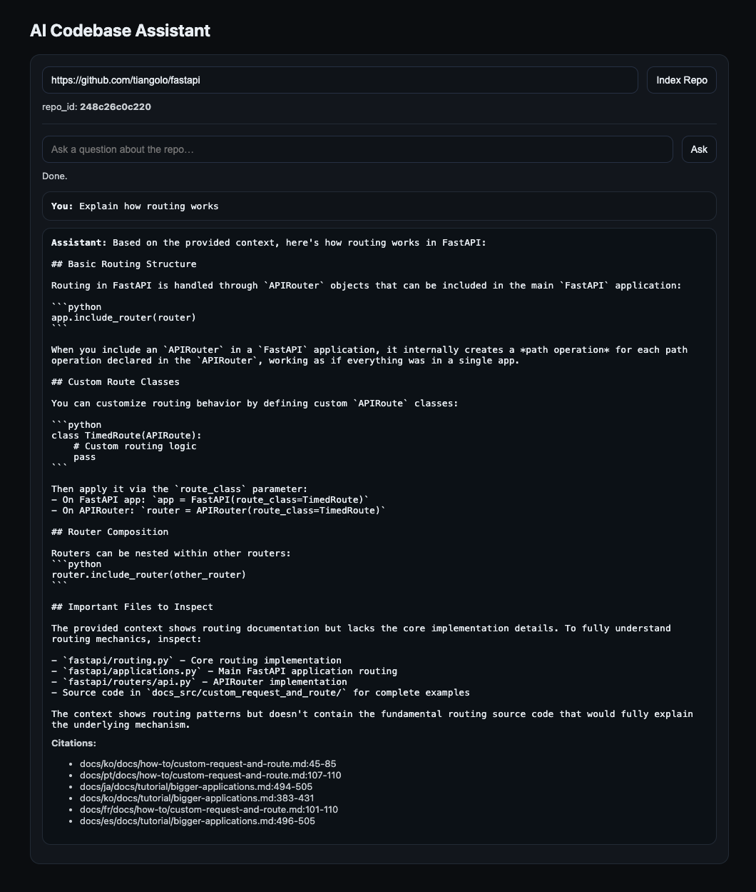
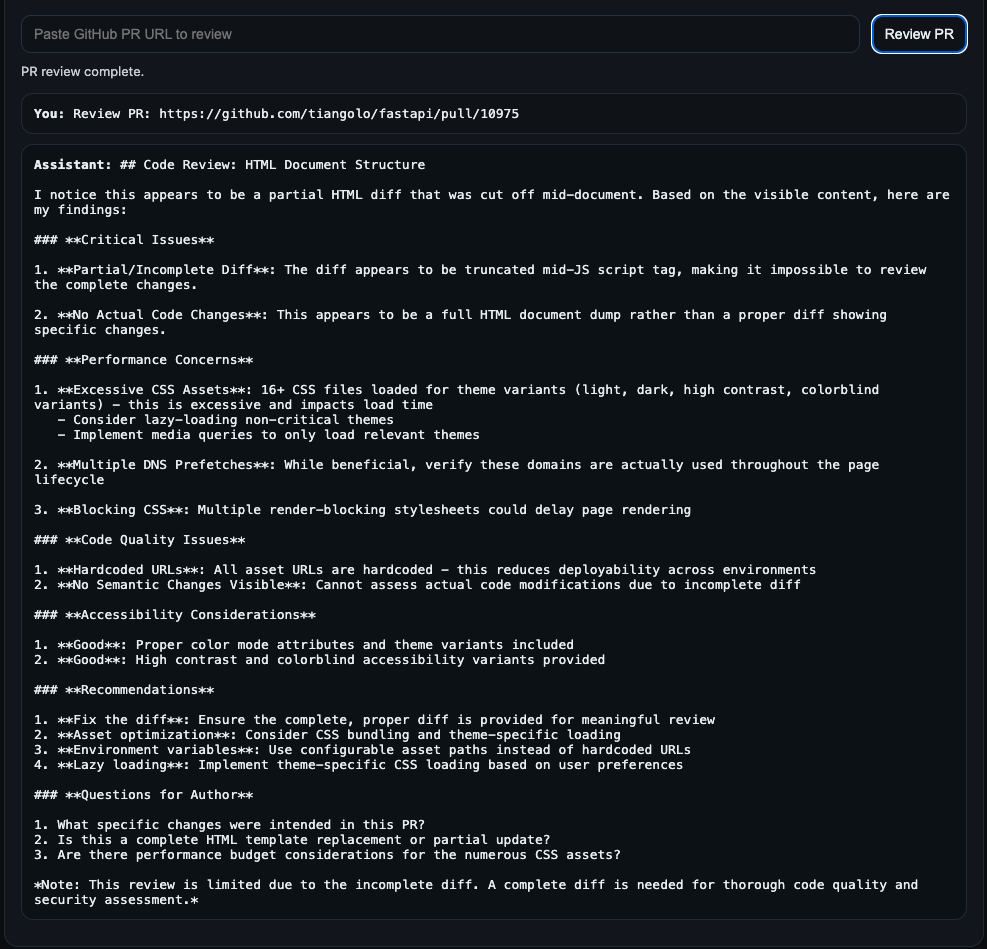
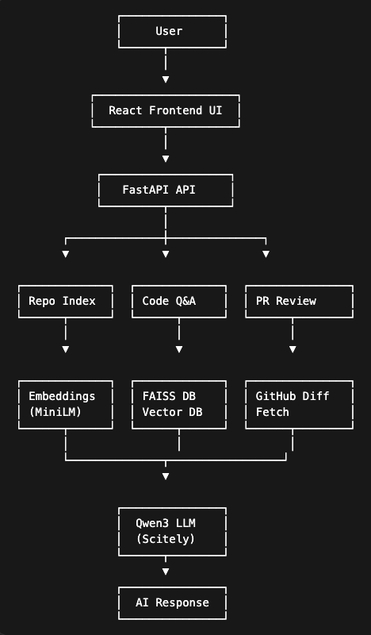

# AI Codebase Assistant

An AI developer assistant that analyzes GitHub repositories and explains how the code works using Retrieval-Augmented Generation (RAG).

It can also review pull requests using LLM-powered code analysis.

---

## Demo





---

## Features

### Codebase Q&A

Ask questions about a repository:

• "Where is authentication implemented?"  
• "Explain how routing works"  
• "What is the entry point of the application?"

The system retrieves relevant code snippets using semantic search and generates contextual explanations.

---

### AI Pull Request Review

Paste a GitHub pull request:

```
https://github.com/repo/project/pull/123
```

The assistant will:

• analyze the diff  
• detect potential bugs  
• suggest improvements  
• highlight performance issues  

---

## Architecture



---

## Tech Stack

Frontend  
React + Vite

Backend  
FastAPI

AI Stack  
SentenceTransformers embeddings  
FAISS vector database  
Qwen3-Coder-Plus via Scitely API

Infrastructure  
Docker

---

## How It Works

### Codebase Analysis

1. Clone GitHub repository  
2. Split code into chunks  
3. Generate embeddings  
4. Store vectors in FAISS  
5. Retrieve relevant snippets  
6. Send context to LLM  
7. Generate explanation

### Pull Request Review

1. Fetch GitHub PR diff  
2. Send diff to LLM  
3. Generate review suggestions

---

## Running Locally

Clone repository

```
git clone https://github.com/YOUR_USERNAME/ai-codebase-assistant
cd ai-codebase-assistant
```

Create environment file

```
cp .env.example .env
```

Add your API key.

Start the system

```
docker compose up --build
```

Open:

```
http://localhost:5173
```

---

## Example Queries

Explain how routing works  
Where is authentication implemented  
What is the main entry point  
Review this pull request

---

## Future Improvements

• streaming responses  
• repository architecture visualization  
• dependency graph explorer  
• GitHub integration